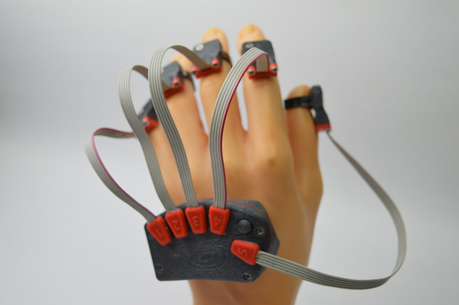
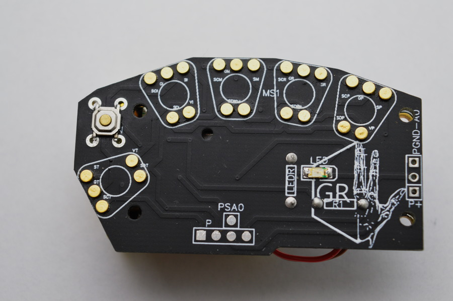
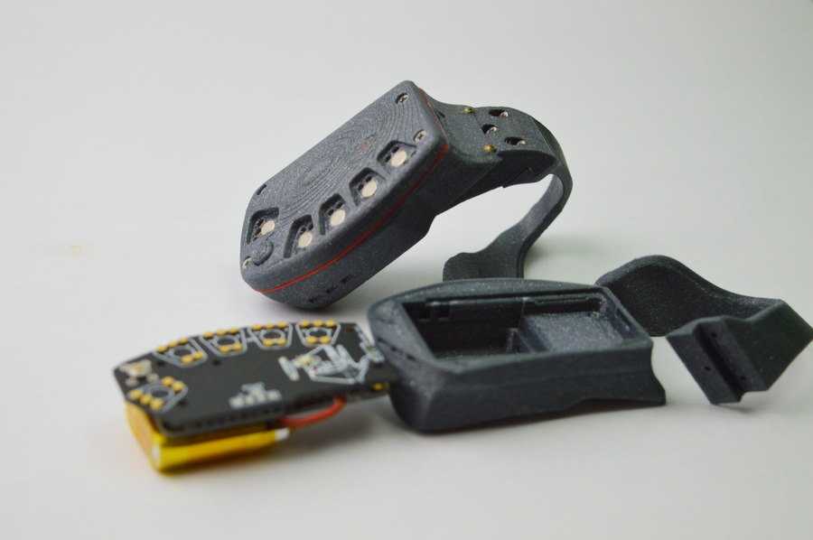
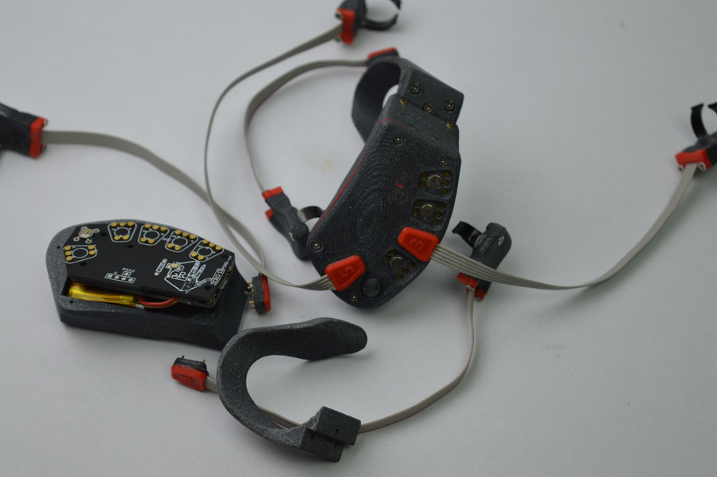
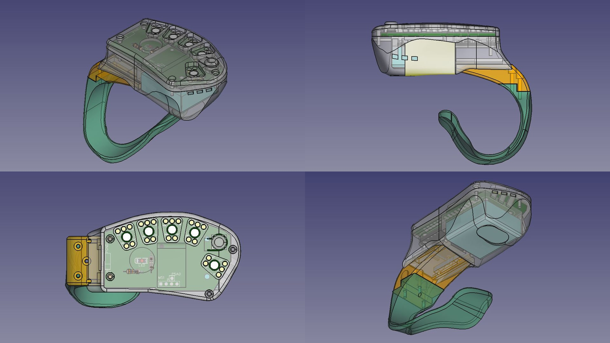

 

  <h1>GR FIRMWARE</h1>
  
This repository contains a development snapshot of the firmware for GR  bracelet. The Firmware is Arduino IDE compatible. The hardware is based on Adafruit Feather ATWINC1500.
 
  
  
GR is a precise gesture recognition and tracking wearable technology that allows digitalization of hand motions and emotions.

  
This Firmware is allows you to collect data from IMU's, and send it over Wifi to machine with preinstaled GR SDK

  

      
    
    
    
    

  

## ✨ Features

- 📶 Easy interaction with hardware with Arduino IDE
- 📈 IMU Data reading
- ⚙️  Raw data sending with minimal ping
- 👀 Palm and fingers tracking
- 🌍 Sign languages translation

## 🔗 Links

- [Instagram](https://www.instagram.com/brainhublab/)
- [Facebook](https://www.facebook.com/brainhublab)

## 🤝 Contact

Email us at [brainhublab@gmail.com](mailto:brainhublab@gmail.com)
